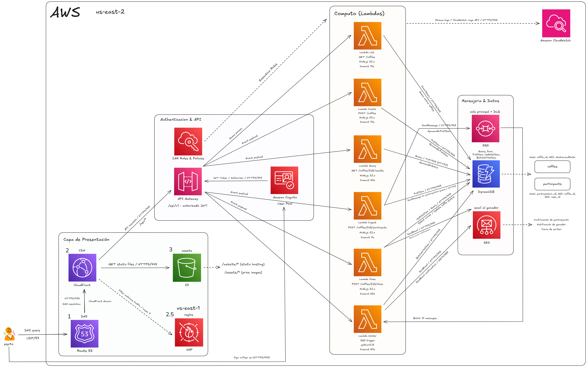
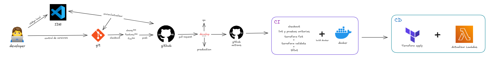

# RaffleNow – Proyecto Infraestructura como Código 
## Descripción general

RaffleNow es una plataforma de sorteos en línea, diseñada para manejar picos de tráfico extremadamente altos y cargas variables.  
El proyecto aplica el enfoque de Infraestructura como Código mediante Terraform, aprovechando servicios serverless de Amazon Web Services para garantizar alta disponibilidad, escalabilidad automática y bajos costos operativos fuera de los picos de uso.

## Caso de estudio

El tráfico de RaffleNow es muy desigual: la mayoría de interacciones ocurre durante la apertura, los últimos minutos antes del cierre y en el anuncio del ganador.  
El sistema que se tenia en cuenta antes era una sola máquina virtual que no podía absorber los picos ni separar ambientes, provocando:

- Caídas durante los sorteos más concurridos.  
- Riesgo operativo alto (despliegues manuales, sin rollback).  
- Costos sobredimensionados fuera de los picos.

Con IaC se logró un entorno modular, reproducible y versionado con tres ambientes:
**Desarrollo (dev)**, **QA (testing)** y **Producción (prod)**.

## Objetivo del proyecto

Entregar una plataforma en la nube estable en picos, económica fuera de ellos y fácil de operar, lista para tres ambientes, con despliegues automáticos desde GitHub Actions mediante Terraform.

## Alcance

- Infraestructura completa en AWS declarada como código
- Separación de ambientes dev, qa y prod
- API REST basada en Lambda + API Gateway
- Base de datos serverless en DynamoDB
- Procesamiento asíncrono con SQS + Worker Lambda
- Autenticación con Amazon Cognito(OIDC / JWT)
- Correo automático al ganador mediante Amazon SES 
- Almacenamiento web estático con S3 + CloudFront  
- Monitoreo y métricas con CloudWatch 
- Despliegue automatizado con GitHub Actions (CI/CD)  

## Arquitectura general

El sistema se compone de:

| Capa | Servicio AWS | Descripción |
|------|---------------|-------------|
| Presentación | S3 + CloudFront + WAF | Sitio web SPA con entrega global y seguridad de borde. |
| Autenticación | Cognito | Login OIDC/OAuth2 con emisión de tokens JWT. |
| API pública | API Gateway (HTTP API) | Exposición de endpoints REST protegidos. |
| Cómputo | AWS Lambda | Lógica de negocio (crear, listar, cerrar sorteos). |
| Datos | DynamoDB | Tabla raffles y participants en modo on-demand. |
| Mensajería | SQS | Buffer anti-picos para procesar participaciones y correos. |
| Correo | SES | Envío de notificaciones al ganador. |
| Monitoreo | CloudWatch / X-Ray | Métricas, trazas y alertas operativas. |

## Flujo CI/CD

1. El desarrollador trabaja en VS Code y sube cambios a GitHub.  
2. Al crear un Pull Request hacia develop, se ejecuta GitHub Actions:  
   - terraform fmt y validate  
   - terraform plan 
   - Pruebas unitarias  
3. Al aprobarse y fusionar a main, se ejecuta el pipeline de despliegue:  
   - terraform apply  
   - Empaquetado y actualización de Lambdas  
   - Publicación de la API y actualización del entorno.  

## Métricas y objetivos

| Métrica | Objetivo | Descripción |
|----------|-----------|-------------|
| Disponibilidad mensual | ≥ 99.9% | Mínimo basado en SLA combinados (Lambda, API GW, DynamoDB). |
| Tiempo de respuesta | ≤ 300 ms (p95) | Consultas a resultados. |
| Tiempo de respuesta | ≤ 500 ms (p95) | Participación y login. |
| Capacidad pico | 400–500 RPS | En eventos virales. |
| Pérdida de datos | 0 | SQS + DLQ garantizan entrega. |

## Tecnologías y herramientas

| Tipo | Herramienta |
|------|--------------|
| Lenguajes | Node.js, Python |
| Infraestructura | Terraform |
| Cloud Provider | AWS |
| Servicios | Lambda, DynamoDB, API Gateway, Cognito, SQS, SES, CloudWatch |
| CI/CD | GitHub Actions |
| Control de versiones | Git / GitHub |
| Monitoreo | CloudWatch Metrics, Alarms y Logs |
| Visualización | Draw.io / Excalidraw (diagramas) |

## Ambientes

| Entorno | Descripción | Rama Git |
|----------|--------------|----------|
| dev | Desarrollo y pruebas internas | develop |
| qa | Validación funcional y rendimiento | release/* |
| prod | Entorno estable en producción | main |

Cada entorno cuenta con su propio state file remoto en S3 y bloqueo con DynamoDB para evitar ejecuciones concurrentes.

## Módulos de Terraform

Ubicados en /iac/modules/:

| Módulo | Propósito |
|--------|------------|
| compute | Despliega funciones Lambda y permisos. |
| api-gateway | Configura API Gateway y rutas. |
| storage | Crea buckets S3 y tablas DynamoDB. |
| scheduler | Configura tareas EventBridge (cierres automáticos). | 
