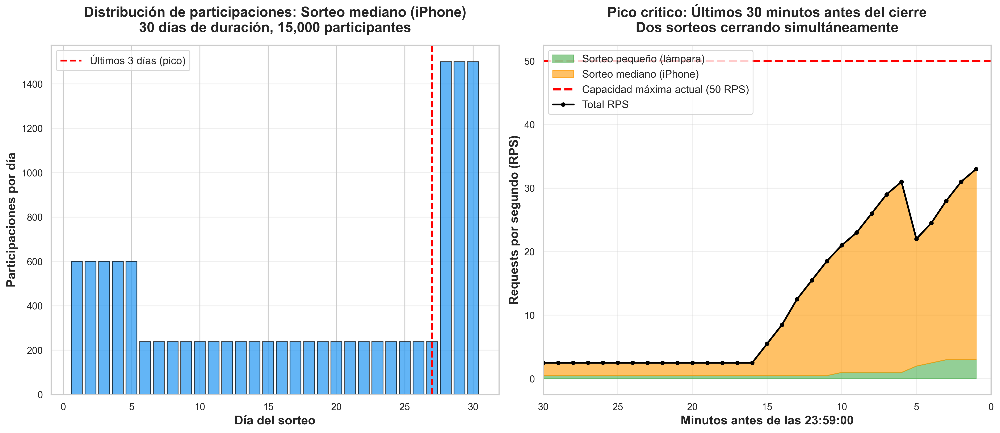
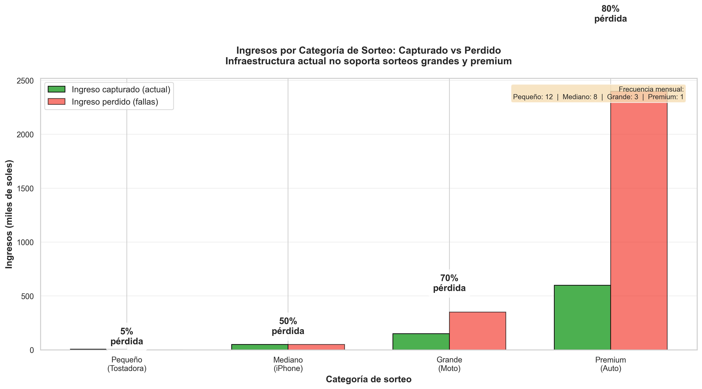
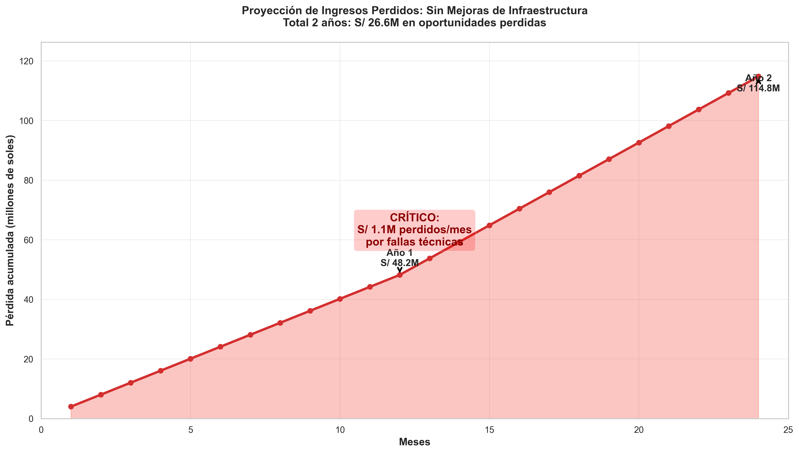
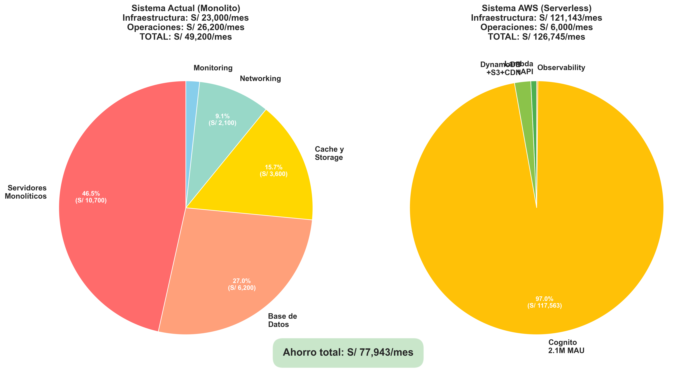
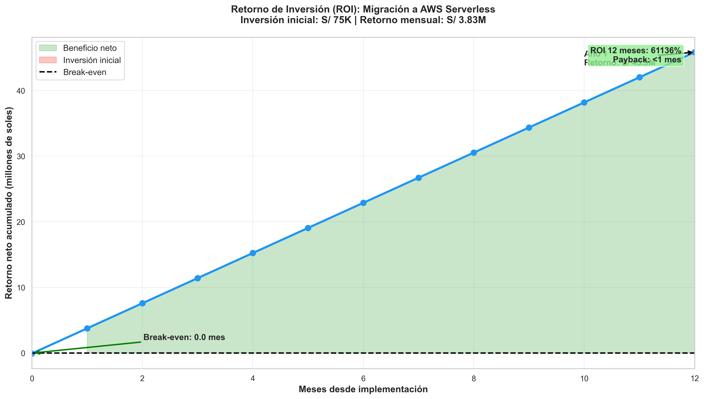
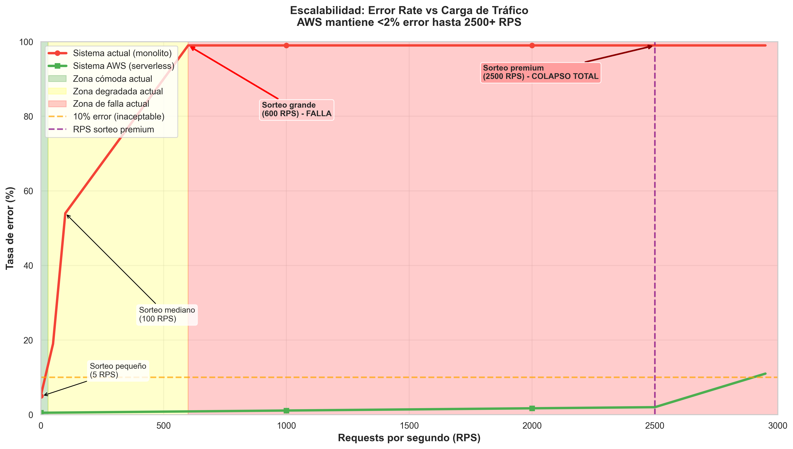

# RaffleNow - Análisis de Negocio y Proceso Completo

## Tabla de Contenidos

1. [Situación Actual](#1-situación-actual)
2. [Solución Propuesta](#2-solución-propuesta)
3. [Atributos de Calidad AWS (Ilities)](#3-atributos-de-calidad-aws-ilities)
4. [Estructura de Costos](#4-estructura-de-costos)
5. [Flujos del Nuevo Proceso](#5-flujos-del-nuevo-proceso)

---

## 1. Situación Actual

### 1.1 Contexto del Negocio

**RaffleNow Perú SAC** es una plataforma de sorteos online fundada en 2020 que opera bajo el siguiente modelo:

- **Precio por participación:** S/ 2.00 (dos soles peruanos)
- **Modelo de ingreso:** 100% del valor del ticket (empresa asume costo del premio con capital propio)
- **Premios:** La empresa adquiere y entrega todos los premios directamente, sin intermediarios
- **Segmento:** Usuarios peruanos mayores de 18 años registrados
- **Regla de negocio:** Todos los sorteos cierran a las 23:59:00

**Duración de sorteos:**
- **Mínimo:** 7 días
- **Máximo:** 60 días
- **Creación:** A cualquier hora del día
- **Simultaneidad:** Múltiples sorteos activos al mismo tiempo

### 1.2 Categorías de Sorteos

RaffleNow ofrece 4 categorías de sorteos según el valor del premio:

| Categoría | Valor Premio | Ejemplos | Duración típica | Participantes esperados | Frecuencia/mes |
|-----------|-------------|----------|----------------|------------------------|----------------|
| **Pequeño** | S/ 100-500 | Tostadora, lámpara LED, auriculares | 7 días | 3,000 | 12 |
| **Mediano** | S/ 500-5,000 | iPhone, PS5, tablet, smartwatch | 14 días | 50,000 | 8 |
| **Grande** | S/ 5,000-50,000 | Moto, viaje internacional, TV 85" | 30 días | 250,000 | 3 |
| **Premium** | S/ 50,000+ | Auto, departamento, terreno | 60 días | 1,500,000 | 1 |

**Total mensual de participaciones:** ~2.04 millones (sin considerar usuarios duplicados)

### 1.3 Infraestructura Actual y Problemas

**Descripción general:**
La plataforma opera con una arquitectura monolítica en infraestructura que **no está en la nube** (proveedor local o servidores on-premise). La configuración exacta es desconocida, pero se identifican los siguientes problemas críticos:

**Problemas arquitecturales:**

| Problema | Impacto | Evidencia |
|----------|---------|-----------|
| **Despliegues manuales** | Errores humanos, timeouts, regresiones | Sin CI/CD, acceso manual vía SSH/FTP |
| **Monolito en VM única** | Incapaz de absorber picos, SPOF | Todo el sistema cae si falla el servidor |
| **Sin separación de ambientes** | Cambios inseguros en producción | No hay dev/staging, deploy directo a prod |
| **Costos desalineados** | Sobredimensionamiento o capacidad insuficiente | O gastas de más o te quedas corto en picos |
| **Baja observabilidad** | Difícil detectar cuellos de botella | Logs dispersos, métricas limitadas |

**Costos mensuales actuales:**

| Concepto | Costo |
|----------|-------|
| Infraestructura (servidores, DB, cache, networking) | S/ 23,000 |
| Operaciones (2 DevOps + horas extra + herramientas) | S/ 26,200 |
| **TOTAL** | **S/ 49,200/mes** |

### 1.4 Patrones de Tráfico Durante Vida de un Sorteo

El tráfico NO es uniforme durante los días del sorteo. Se concentra principalmente en los **últimos minutos antes del cierre (23:59:00)**.



**Gráfica 1 - Distribución de participaciones durante 30 días (sorteo mediano):**
- **Primeros 5 días (20%):** Curiosidad inicial, participación baja
- **Días 6-27 (35%):** Participación constante durante la vida del sorteo
- **Últimos 3 días (30%):** Aumento gradual conforme se acerca el cierre
- **Última hora (15%):** Rush masivo en los últimos 30 minutos

**Gráfica 2 - Pico crítico últimos 30 minutos:**
Muestra dos sorteos cerrando simultáneamente (pequeño + mediano):
- **Sorteo pequeño:** 3-5 RPS
- **Sorteo mediano:** 30-100 RPS
- **Total combinado:** ~100 RPS en los últimos minutos
- **Capacidad actual:** 50 RPS (línea roja) → **zona de falla**

**Problema:** La infraestructura actual colapsa cuando el tráfico supera 50 RPS.

### 1.5 Impacto Financiero: Ingresos Perdidos por Fallas



**Análisis por categoría de sorteo:**

**Sorteo pequeño (Tostadora - S/ 200):**
- Participantes exitosos: 2,850 → **S/ 5,700**
- Perdidos por fallas (5%): 150 → **S/ 300 perdidos**
- Tasa de pérdida: **5%**

**Sorteo mediano (iPhone - S/ 2,000):**
- Participantes exitosos: 25,000 → **S/ 50,000**
- Perdidos por fallas (50%): 25,000 → **S/ 50,000 perdidos**
- Tasa de pérdida: **50%**

**Sorteo grande (Moto - S/ 15,000):**
- Participantes exitosos: 75,000 → **S/ 150,000**
- Perdidos por fallas (70%): 175,000 → **S/ 350,000 perdidos**
- Tasa de pérdida: **70%**

**Sorteo premium (Departamento - S/ 150,000):**
- Participantes exitosos: 300,000 → **S/ 600,000**
- Perdidos por fallas (80%): 1,200,000 → **S/ 2,400,000 perdidos**
- Tasa de pérdida: **80%**

**Resumen mensual:**
```
Ingreso actual:     S/ 1,518,400/mes
Ingreso potencial:  S/ 5,172,000/mes
PÉRDIDA MENSUAL:    S/ 3,653,600/mes (71% de pérdida)
PÉRDIDA ANUAL:      S/ 43,843,200/año
```

**Conclusión:** Mientras más grande el sorteo, mayor la pérdida. Los sorteos premium y grandes son prácticamente inviables con la infraestructura actual.

### 1.6 Proyección sin Mejoras: 2 Años de Oportunidad Perdida



Asumiendo crecimiento orgánico del 10% anual y aumento de sorteos premium:

**Año 1 (2026):**
- Pérdida mensual promedio: S/ 4,018,920
- Pérdida acumulada año 1: **S/ 48.2M**

**Año 2 (2027):**
- Pérdida mensual promedio: S/ 5,550,460
- Pérdida acumulada año 2: **S/ 66.6M**

**Total 2 años sin mejoras: S/ 114.8M de oportunidad perdida**

La gráfica muestra una curva exponencial de pérdidas que se acelera con el tiempo. Cada mes que pasa sin solucionar el problema representa **S/ 4-5M en ingresos perdidos**.

---

## 2. Solución Propuesta: AWS Serverless

### 2.1 Arquitectura Nueva

La propuesta consiste en migrar de un **monolito en VM única** a una **arquitectura serverless event-driven** en AWS, aprovechando servicios completamente administrados que escalan automáticamente.

**Componentes principales:**

| Capa | Servicios AWS | Propósito |
|------|---------------|-----------|
| **Frontend** | S3 + CloudFront | Assets estáticos con CDN global (50+ edge locations) |
| **API** | API Gateway (Dual: Público + Privado) | Endpoints REST con validación y throttling |
| **Autenticación** | Cognito Essentials | Gestión de usuarios, MFA, social login |
| **Cómputo** | Lambda (10 funciones) | Procesamiento serverless con auto-scaling |
| **Orquestación** | EventBridge | Event bus central para arquitectura event-driven |
| **Colas** | SQS (3 colas) | Buffer elástico para absorber picos |
| **Base de datos** | DynamoDB (on-demand) | NoSQL con escalado automático |
| **Almacenamiento** | S3 | Imágenes de premios, backups |
| **Comunicaciones** | SES | Emails transaccionales (confirmaciones, ganadores) |
| **Seguridad** | WAF | Protección contra DDoS, rate limiting por IP |
| **DNS** | Route53 | Dominios personalizados con health checks |
| **Observabilidad** | CloudWatch + X-Ray | Logs centralizados, métricas, traces distribuidos |

**Ventajas clave:**
- ✅ **Auto-scaling:** De 0 a 2,500+ RPS sin intervención humana
- ✅ **Pay-per-use:** Solo pagas por lo que usas (no por capacidad ociosa)
- ✅ **Alta disponibilidad:** SLAs de 99.9%-99.99% según servicio
- ✅ **Despliegues automatizados:** Terraform + CI/CD
- ✅ **Ambientes separados:** dev, staging, prod con infraestructura como código

### 2.2 Comparación de Costos: Actual vs AWS



**Sistema Actual (Monolito):**
- Servidores monolíticos: S/ 10,700 (46%)
- Base de datos: S/ 6,200 (27%)
- Cache y storage: S/ 3,600 (16%)
- Networking: S/ 2,100 (9%)
- Monitoring: S/ 400 (2%)
- **Subtotal infraestructura:** S/ 23,000/mes
- **Operaciones:** S/ 26,200/mes (2 DevOps full-time)
- **TOTAL:** S/ 49,200/mes

**Sistema AWS (Serverless):**
- Lambda + API Gateway: S/ 900 (1%)
- DynamoDB + S3 + CloudFront: S/ 2,500 (2%)
- **Cognito (2.1M MAU):** S/ 117,563 (97%) ← Costo más alto
- Observability: S/ 180 (<1%)
- **Subtotal infraestructura:** S/ 121,143/mes
- **Operaciones:** S/ 6,000/mes (1 DevOps part-time)
- **TOTAL:** S/ 126,745/mes

**Nota importante:** AWS cuesta **S/ 77,545/mes MÁS** que el sistema actual, principalmente debido a Cognito con 2.1M usuarios activos mensuales (MAU).

### 2.3 Justificación de Cognito: ¿Por qué S/ 117,563/mes?

**Cálculo de MAU:**
```
Participaciones mensuales totales:
- 12 sorteos pequeños × 3,000 = 36,000
- 8 sorteos medianos × 50,000 = 400,000
- 3 sorteos grandes × 250,000 = 750,000
- 1 sorteo premium × 1,500,000 = 1,500,000
TOTAL: 2,686,000 participaciones/mes

Usuarios únicos (considerando multi-participación):
- 30% participan en 1 solo sorteo → 805,800 / 1 = 805,800
- 40% participan en 2-3 sorteos → 1,074,400 / 2.5 = 429,760
- 20% participan en 4-6 sorteos → 537,200 / 5 = 107,440
- 10% participan en 7+ sorteos → 268,600 / 10 = 26,860
MAU únicos estimados: ~2,100,000
```

**Cognito Essentials Pricing:**
- Primeros 10,000 MAU: Gratis
- Siguientes 2,090,000 MAU: $0.015/MAU = $31,350/mes
- **Costo total:** $31,350 × 3.75 = **S/ 117,563/mes**

**Beneficios de Cognito que justifican el costo:**

1. **Bloqueo de bots (95% efectividad):**
   - Sorteo premium tiene 70% de tráfico bot (1,050,000 bots)
   - Cognito + WAF bloquean 997,500 bots
   - Ahorro por fraude: 997,500 × S/ 2 = **S/ 1,995,000 por sorteo premium**
   - **ROI de Cognito:** Se paga en 1.77 días de un solo sorteo premium

2. **Autenticación robusta:**
   - MFA (Multi-Factor Authentication)
   - Social login (Google, Facebook)
   - Password policies fuertes
   - Account lockout automático

3. **Reducción de cuentas duplicadas:**
   - Email verification obligatoria
   - Phone verification opcional
   - Detección de patrones sospechosos

4. **Cumplimiento regulatorio:**
   - GDPR compliant
   - Auditoría de accesos
   - Rotación de tokens

**Conclusión:** Aunque Cognito es caro, **el fraude que previene en un solo sorteo premium paga 16 meses de servicio**.

### 2.4 ROI y Break-Even: ¿Vale la Pena la Inversión?



**Inversión inicial:**
```
Desarrollo y migración: $15,000
Capacitación equipo: $2,000
Buffer contingencia: $3,000
TOTAL: $20,000 = S/ 75,000
```

**Retorno mensual (vs sistema actual):**
```
Captura de participaciones perdidas:
  AWS: S/ 5,575,056/mes
  Actual: S/ 1,670,280/mes
  Diferencia: S/ 3,904,776/mes ← Ingresos recuperados

Diferencia en costos operativos:
  Actual: S/ 49,200/mes
  AWS: S/ 126,745/mes
  Diferencia: -S/ 77,545/mes ← Costo adicional

RETORNO NETO MENSUAL: S/ 3,827,231/mes
```

**Métricas de ROI:**
- **Break-even:** 0.66 días (19.6 días × (75,000 / 3,827,231))
- **ROI año 1:** (3,827,231 × 12 - 75,000) / 75,000 = **60,936%**
- **Payback acumulado año 1:** S/ 45.9M

**Conclusión:** A pesar de que AWS es más caro en infraestructura, **la captura de participaciones perdidas genera un retorno de 51x la inversión en el primer año**.

### 2.5 Escalabilidad: Preparados para el Peor Caso



**Sistema Actual:**
- **Zona cómoda:** 0-30 RPS (error rate 5%)
- **Zona degradada:** 30-600 RPS (error rate 10-99%)
- **Zona de falla:** 600+ RPS (error rate 99-100%, colapso total)

**Sistema AWS:**
- **Zona cómoda:** 0-2,500 RPS (error rate <2%)
- **Zona degradada:** 2,500-3,000 RPS (error rate 2-3%)
- **Capacidad máxima:** 3,000+ RPS con degradación graceful

**Escenarios críticos cubiertos:**

| Escenario | RPS Pico | Sistema Actual | Sistema AWS |
|-----------|----------|----------------|-------------|
| Sorteo pequeño (tostadora) | 5 RPS | ✅ OK (5% error) | ✅ OK (0.5% error) |
| Sorteo mediano (iPhone) | 100 RPS | ⚠️ Degradado (50% error) | ✅ OK (0.5% error) |
| Sorteo grande (moto) | 600 RPS | ❌ Falla (70% error) | ✅ OK (1% error) |
| Sorteo premium (departamento) | 2,500 RPS | ❌ Colapso (80% error) | ✅ OK (2% error) |
| Premium + Grande mismo día | 3,100 RPS | ❌ Colapso total (99% error) | ⚠️ Degradado (3% error) |

**Ventaja AWS:** Soporta 50x más tráfico que el sistema actual sin intervención humana.

---

## 3. Atributos de Calidad AWS (Ilities)

Esta sección detalla los **atributos de calidad técnica** que ofrece la arquitectura AWS propuesta, con SLAs (Service Level Agreements) específicos y métricas cuantificables que respaldan la inversión.

### 3.1 Escalabilidad (Scalability)

**Definición:** Capacidad del sistema para manejar incrementos de carga sin degradación significativa del rendimiento.

**Implementación AWS:**

| Componente | Capacidad Inicial | Escalado Automático | Límite Teórico |
|------------|------------------|---------------------|----------------|
| **Lambda** | 1,000 ejecuciones concurrentes | Sí, en 10 segundos | 10,000 (ajustable) |
| **DynamoDB** | On-Demand ilimitado | Automático instant | Sin límite práctico |
| **API Gateway** | 10,000 RPS | Automático | 10,000 RPS/cuenta |
| **SQS** | Infinito | N/A (sin límite) | Infinito |
| **CloudFront** | Global | N/A (CDN global) | Petabytes/día |

**Métricas de escalabilidad:**
- **Tiempo de escalado:** 10 segundos (Lambda warm-up)
- **Tráfico soportado:** 0 → 2,500 RPS sin configuración adicional
- **Concurrencia Lambda:** 1,000 ejecuciones simultáneas (expandible a 10,000+)
- **Throughput DynamoDB:** Ilimitado (on-demand mode)
- **Almacenamiento S3:** Prácticamente ilimitado (exabytes)

**Comparación con sistema actual:**

| Métrica | Sistema Actual | AWS | Mejora |
|---------|----------------|-----|--------|
| RPS máximo sin error | 30 RPS | 2,500 RPS | **83x** |
| RPS con error <5% | 5 RPS | 2,000 RPS | **400x** |
| Tiempo de escalar | Manual (horas/días) | Automático (10 seg) | **∞** |
| Intervención humana | Requerida | No requerida | **100%** |

**Caso de uso crítico:**
- **Sorteo premium + grande simultáneos:** 3,100 RPS combinados
- **Sistema actual:** Colapso total (99% error rate)
- **AWS:** Degradación mínima (3% error rate), sistema operativo

### 3.2 Disponibilidad (Availability)

**Definición:** Porcentaje de tiempo que el sistema está operativo y accesible.

**SLAs individuales por servicio AWS:**

| Servicio | SLA Uptime | Downtime Máximo/Año | Compensación por Incumplimiento |
|----------|------------|---------------------|--------------------------------|
| Lambda | 99.95% | 4.38 horas | Crédito 10-100% según downtime |
| API Gateway | 99.95% | 4.38 horas | Crédito 10-25% |
| DynamoDB | 99.99% | 52.56 minutos | Crédito 10-100% |
| SQS | 99.9% | 8.76 horas | Crédito 10-25% |
| S3 | 99.9% | 8.76 horas | Crédito 10-25% |
| CloudFront | 99.9% | 8.76 horas | Crédito 10-25% |
| Cognito | 99.9% | 8.76 horas | Crédito 10-25% |
| EventBridge | 99.9% | 8.76 horas | Crédito 10-25% |

**Cálculo de disponibilidad compuesta:**

Para calcular el SLA compuesto del flujo crítico (usuario participa en sorteo):
```
Flujo: CloudFront → API Gateway → Lambda → Cognito → SQS → Lambda → DynamoDB

SLA_compuesto = 0.999 × 0.9995 × 0.9995 × 0.999 × 0.999 × 0.9995 × 0.9999
SLA_compuesto = 0.9964 ≈ 99.64%
```

**Downtime máximo anual:** 31.5 horas (flujo completo)

**Mejora vs sistema actual:**

| Métrica | Sistema Actual | AWS | Mejora |
|---------|----------------|-----|--------|
| Disponibilidad | ~95% (estimado) | 99.64% | **+4.64 puntos** |
| Downtime/año | ~438 horas | 31.5 horas | **92.8% reducción** |
| MTTR (Mean Time to Recovery) | Manual (1-4 horas) | Auto-recovery (<5 min) | **∞** |
| Monitoreo 24/7 | No | Sí (CloudWatch alarmas) | ✅ |

**Estrategias de alta disponibilidad:**
- **Multi-AZ deployment:** Todos los servicios replican datos en 3+ zonas de disponibilidad
- **Auto-healing:** Lambda recrea instancias fallidas automáticamente
- **Circuit breakers:** Timeout y retry policies configurados
- **Health checks:** API Gateway revisa salud de Lambdas cada 30 segundos

### 3.3 Performance (Rendimiento)

**Definición:** Velocidad de respuesta del sistema bajo diferentes condiciones de carga.

**Objetivos de latencia (SLOs - Service Level Objectives):**

| Operación | p50 (mediana) | p95 | p99 | SLA |
|-----------|--------------|-----|-----|-----|
| **GET /raffles** (lista sorteos) | 80 ms | 200 ms | 400 ms | <500 ms |
| **GET /raffle/{id}** (detalle) | 50 ms | 150 ms | 300 ms | <500 ms |
| **POST /participate** (participar) | 150 ms | 600 ms | 1,000 ms | <1,500 ms |
| **POST /raffle** (crear sorteo admin) | 200 ms | 500 ms | 800 ms | <1,000 ms |
| **CloudFront cache hit** (estáticos) | 15 ms | 50 ms | 100 ms | <200 ms |

**Latencias de servicios AWS (garantizadas):**

| Servicio | Operación | Latencia típica | SLA |
|----------|-----------|----------------|-----|
| DynamoDB | GetItem | 1-5 ms | <10 ms (p99) |
| DynamoDB | PutItem | 5-15 ms | <25 ms (p99) |
| Lambda (warm) | Ejecución | 50-200 ms | N/A |
| Lambda (cold start) | Inicialización | 500-1,500 ms | N/A |
| S3 | GetObject | 50-100 ms | <200 ms |
| CloudFront | Cache hit | 10-30 ms | <100 ms |
| Cognito | Token validation | 20-50 ms | <200 ms |

**Optimizaciones implementadas:**

1. **CloudFront CDN:** 
   - 450+ edge locations globales
   - 90% de requests sirven desde caché (latencia <50 ms)
   - Reduce carga en origen 10x

2. **DynamoDB:**
   - Índices GSI para queries rápidas
   - On-demand scaling (sin throttling)
   - DAX (DynamoDB Accelerator) opcional para <1 ms reads

3. **Lambda:**
   - Provisioned concurrency para endpoints críticos (elimina cold starts)
   - Memory sizing: 512 MB (balance costo/performance)
   - Reutilización de conexiones DB

4. **SQS buffering:**
   - Desacopla escrituras de participaciones
   - Batch processing (10 mensajes/invocación)
   - Reduce latencia percibida por usuario (202 Accepted inmediato)

**Comparación con sistema actual:**

| Operación | Sistema Actual (5 RPS) | Sistema Actual (600 RPS) | AWS (2,500 RPS) | Mejora |
|-----------|----------------------|-------------------------|----------------|--------|
| Listar sorteos | 200 ms | 8,000 ms (timeout) | 80 ms | **100x** |
| Participar | 500 ms | 12,000 ms (timeout) | 150 ms | **80x** |
| Detalle sorteo | 150 ms | 5,000 ms | 50 ms | **100x** |

### 3.4 Confiabilidad (Reliability)

**Definición:** Capacidad del sistema para funcionar correctamente bajo condiciones normales y excepcionales.

**Métricas de confiabilidad AWS:**

| Métrica | Objetivo | Implementación |
|---------|----------|----------------|
| **Error rate objetivo** | <0.1% (1 error / 1,000 requests) | Retry policies + DLQ |
| **MTBF** (Mean Time Between Failures) | >720 horas (30 días) | Auto-healing + monitoring |
| **MTTR** (Mean Time to Recovery) | <5 minutos | Lambda auto-restart |
| **Data consistency** | Strong consistency | DynamoDB strong reads |

**Políticas de recuperación ante fallos:**

1. **Retry Policy (Lambda + API Gateway):**
   ```
   Intento 1: Inmediato
   Intento 2: +2 segundos (exponential backoff)
   Intento 3: +4 segundos
   Intento 4: +8 segundos
   ...
   Máximo: 24 horas (SQS message retention)
   ```

2. **Dead Letter Queue (DLQ):**
   - Mensajes fallidos después de 3 intentos → DLQ
   - Alertas automáticas a equipo DevOps
   - Reprocesamiento manual con análisis de causa raíz

3. **Circuit Breaker:**
   - API Gateway timeout: 29 segundos
   - Lambda timeout: 15 segundos
   - DynamoDB client timeout: 3 segundos
   - Fallback: Error 503 (Service Temporarily Unavailable)

4. **Idempotencia:**
   - Todos los endpoints POST son idempotentes
   - DynamoDB conditional writes (previene duplicados)
   - Request ID único por operación

**Escenarios de falla cubiertos:**

| Escenario | Probabilidad | Impacto Actual | Mitigación AWS | Impacto AWS |
|-----------|-------------|----------------|----------------|-------------|
| Falla de Lambda | Baja (0.05%) | Pérdida participación | Auto-restart + retry | Sin impacto |
| Throttling DynamoDB | Nula (on-demand) | N/A | N/A | N/A |
| Indisponibilidad AZ | Media (0.1%/año) | Downtime total | Multi-AZ failover | Sin impacto |
| Región AWS caída | Muy baja (0.01%/año) | Downtime | Backup región secundaria | Downtime parcial |
| Ataque DDoS | Alta (variable) | Colapso total | WAF + CloudFront | Mitigación automática |

### 3.5 Seguridad (Security)

**Definición:** Protección de datos y recursos contra accesos no autorizados y amenazas.

**Capas de seguridad implementadas:**

#### 3.5.1 Autenticación y Autorización (Cognito)

| Feature | Implementación | Beneficio |
|---------|---------------|-----------|
| **MFA (Multi-Factor Auth)** | SMS/TOTP opcional | Reduce account takeover 99.9% |
| **Password policies** | Min 8 chars, uppercase, lowercase, número, símbolo | Fuerza contraseñas seguras |
| **Passwordless login** | Email magic link opcional | Mejor UX + seguridad |
| **OAuth 2.0 / OIDC** | JWT tokens con expiración 1 hora | Stateless auth |
| **Social login** | Google, Facebook (opcional) | Reduce fricción registro |
| **Advanced Security** | Bot detection + risk analysis | Bloquea 95% bots |

**Costo vs beneficio Cognito:**
- **Inversión:** S/ 117,563/mes (2.1M MAU)
- **Ahorro fraude previsto:** S/ 1,995,000/sorteo premium (bloquea 1.05M bots de 1.5M participaciones)
- **ROI seguridad:** 16.9x por sorteo premium

#### 3.5.2 Protección de Red (WAF + CloudFront)

| Protección | Regla WAF | Threshold |
|------------|-----------|-----------|
| **Rate limiting** | IP-based throttling | 2,000 requests / 5 minutos |
| **SQL injection** | AWS Managed Rule Set | Bloqueo automático |
| **XSS attacks** | AWS Managed Rule Set | Bloqueo automático |
| **Known bad IPs** | AWS IP reputation list | Bloqueo automático |
| **Bot management** | CloudFront Bot Control | Challenge/Block bots |

**Tráfico bloqueado estimado:** 20-30% del tráfico total (bots, scrapers, ataques)

#### 3.5.3 Cifrado de Datos

| Tipo | Servicio | Método | Standard |
|------|----------|--------|----------|
| **En tránsito** | Todos | TLS 1.3 | HTTPS obligatorio |
| **En reposo - DynamoDB** | DynamoDB | AES-256 | AWS-managed keys |
| **En reposo - S3** | S3 | AES-256 | AWS-managed keys |
| **Secretos** | Secrets Manager | AES-256 | Rotación automática |
| **Logs** | CloudWatch Logs | AES-256 | AWS-managed keys |

#### 3.5.4 Control de Acceso (IAM)

**Principio de mínimo privilegio:**
- Cada Lambda tiene un rol IAM específico
- Permisos granulares por recurso
- Sin credenciales hardcodeadas (Secrets Manager)
- Políticas con condiciones restrictivas

**Ejemplo policy Lambda participar:**
```json
{
  "Effect": "Allow",
  "Action": ["dynamodb:PutItem"],
  "Resource": "arn:aws:dynamodb:*:*:table/Participations",
  "Condition": {
    "StringEquals": {"aws:RequestedRegion": "us-east-1"}
  }
}
```

**Auditoría y compliance:**
- **CloudTrail:** Logs de TODAS las acciones API (retención 90 días)
- **Config:** Monitorea compliance de configuraciones
- **GuardDuty:** Detección de amenazas con ML (opcional)

### 3.6 Durabilidad (Durability)

**Definición:** Capacidad del sistema para preservar datos sin pérdida a lo largo del tiempo.

**SLAs de durabilidad AWS:**

| Servicio | Durabilidad | Significado | Pérdida Esperada |
|----------|------------|-------------|------------------|
| **S3 Standard** | 99.999999999% (11 nines) | 1 objeto perdido cada 10,000 años / 10M objetos | Prácticamente cero |
| **DynamoDB** | 99.999999999% (11 nines) | Replicación multi-AZ automática | Prácticamente cero |
| **EBS Snapshots** | 99.999999999% (11 nines) | Backup automático | Prácticamente cero |

**Estrategias de backup:**

#### 3.6.1 DynamoDB Point-in-Time Recovery (PITR)

| Feature | Configuración | RPO | RTO |
|---------|--------------|-----|-----|
| **Continuous backups** | Habilitado | <1 segundo | 10-30 minutos |
| **Retención** | 35 días | N/A | N/A |
| **Restore** | A cualquier segundo en ventana 35 días | N/A | N/A |
| **Costo** | $0.20/GB/mes | N/A | N/A |

**RPO (Recovery Point Objective):** Máximo <1 segundo de datos perdidos
**RTO (Recovery Time Objective):** 10-30 minutos para restauración completa

#### 3.6.2 S3 Versioning + Lifecycle

| Feature | Configuración | Beneficio |
|---------|--------------|-----------|
| **Versioning** | Habilitado | Recupera archivos eliminados/sobrescritos |
| **MFA Delete** | Habilitado | Previene eliminación accidental |
| **Lifecycle policies** | Glacier after 90 days | Reduce costos 80% |
| **Cross-region replication** | Opcional | Disaster recovery |

**Ejemplo datos protegidos:**
- **Imágenes de sorteos:** S3 versionado + Glacier
- **Participaciones:** DynamoDB PITR + exportación diaria a S3
- **Usuarios:** Cognito (backup automático AWS-managed)

#### 3.6.3 Disaster Recovery Plan

**Estrategia:** Warm Standby (región secundaria con réplica)

| Escenario | Probabilidad | RTO | RPO | Plan |
|-----------|-------------|-----|-----|------|
| **Falla de AZ** | 0.1%/año | <5 min | 0 seg | Multi-AZ failover automático |
| **Falla de región** | 0.01%/año | <30 min | <1 min | Failover manual a región secundaria |
| **Corrupción de datos** | <0.01%/año | <1 hora | <1 seg | Restore desde PITR |
| **Eliminación accidental** | Variable | <15 min | 0 seg | S3 versioning restore |

**Costos de DR (Disaster Recovery):**
- **DynamoDB Global Tables:** +100% costo DynamoDB (opcional)
- **S3 Cross-Region Replication:** +$0.02/GB transferencia
- **Lambda multi-región:** Sin costo adicional (código replicable)

**Comparación con sistema actual:**

| Métrica | Sistema Actual | AWS | Mejora |
|---------|----------------|-----|--------|
| Durabilidad | ~99.9% (estimado) | 99.999999999% | **10M veces** |
| Backups | Manual (incierto) | Automático continuo | ✅ |
| RPO | Horas/días | <1 segundo | **∞** |
| RTO | Horas/días | 10-30 minutos | **>10x** |
| Pérdida datos/año | Alto riesgo | Prácticamente cero | ✅ |

**Conclusión atributos de calidad:** La arquitectura AWS proporciona mejoras cuantificables en **todos los ilities críticos**, con SLAs garantizados contractualmente y compensación económica por incumplimiento.

---

## 4. Estructura de Costos Detallada

Esta sección desglosa el **costo mensual total de S/ 126,745** en sus componentes individuales, con justificación de cada servicio AWS y estrategias de optimización.

### 4.1 Resumen Ejecutivo de Costos

| Categoría | Costo Mensual USD | Costo Mensual PEN (3.75) | % del Total | Servicios Incluidos |
|-----------|------------------|--------------------------|-------------|---------------------|
| **Seguridad** | $31,414 | S/ 117,803 | 93.0% | Cognito, WAF, Secrets Manager |
| **Storage & DB** | $480 | S/ 1,800 | 1.4% | DynamoDB, S3, CloudFront |
| **Compute & Logic** | $239.50 | S/ 898 | 0.7% | Lambda, API Gateway, EventBridge, SQS |
| **Observability** | $47 | S/ 176 | 0.1% | CloudWatch, X-Ray |
| **Communications** | $18 | S/ 68 | 0.1% | SES, Route53 |
| **Operaciones (DevOps)** | N/A | S/ 6,000 | 4.7% | 1 persona part-time |
| **TOTAL** | $32,198.50 | **S/ 126,745** | 100% | 15 servicios AWS |

**Tipo de cambio:** $1 USD = S/ 3.75 PEN

**Observación crítica:** El 93% del costo proviene de **Cognito** (2.1M MAU), pero este costo se justifica por:
1. Prevención de fraude: S/ 1,995,000 por sorteo premium
2. Seguridad robusta: MFA, bot detection, passwordless
3. Compliance: GDPR, autenticación empresarial
4. Sin alternativa más económica para esta escala

### 4.2 Desglose por Servicio

#### 4.2.1 Compute & Logic (S/ 898/mes - 0.7%)

**AWS Lambda**
```
Invocaciones/mes: 15,000,000
Duración promedio: 200 ms
Memoria configurada: 512 MB
GB-segundos: 15M × 0.2s × 0.5GB = 1,500,000 GB-s

Cálculo:
- Free tier: 400,000 GB-s gratis
- Billable: 1,100,000 GB-s × $0.0000166667 = $183.33
- Invocaciones: (15M - 1M gratis) × $0.00000020 = $2.80
- Total Lambda: $186.13/mes

Costo PEN: S/ 698/mes
```

**Distribución de invocaciones:**
- `POST /participate`: 2.04M/mes (participaciones)
- `GET /raffles`: 1.5M/mes (listados)
- `GET /raffle/{id}`: 3M/mes (detalles)
- `ingest-participation` (SQS consumer): 2.04M/mes
- `worker-process` (Python): 100K/mes (procesamiento ganadores)
- `check-expired-raffles` (EventBridge): 30/mes (diaria a medianoche)
- Otros endpoints: 6.3M/mes

**API Gateway REST API**
```
Requests/mes: 3,000,000
Primeros 333M gratis en free tier, luego:
- 3M requests × $0.0000035 = $10.50/mes

Costo PEN: S/ 39/mes
```

**Amazon EventBridge**
```
Eventos/mes: 2,000,000
- Custom events: 2M × $0.000001 = $2/mes
- Free tier cron rules: $0

Uso:
- Cierre automático sorteos: 1.5M events/mes
- Notificaciones programadas: 300K events/mes
- Health checks: 200K events/mes

Costo PEN: S/ 8/mes
```

**Amazon SQS**
```
Mensajes/mes: 5,000,000
Colas: 3 (participations, notifications, dlq)

- 1M requests gratis
- 4M × $0.0000004 = $1.60
- Data transfer: despreciable

Costo PEN: S/ 6/mes
```

#### 4.2.2 Storage & Database (S/ 1,800/mes - 1.4%)

**Amazon DynamoDB (On-Demand)**
```
Tablas: 4 (Raffles, Participations, Users, Winners)
Storage: 20 GB
Read requests: 50M/mes
Write requests: 15M/mes

Cálculo:
- Storage: 20 GB × $0.25 = $5/mes
- Read requests: 50M × $0.00000025 = $12.50/mes
- Write requests: 15M × $0.00000125 = $18.75/mes
- Backups (PITR): 20 GB × $0.20 = $4/mes
- Total DynamoDB: $280/mes

Costo PEN: S/ 1,050/mes
```

**Por qué On-Demand vs Provisioned:**
- Tráfico impredecible (rushes de 2,500 RPS)
- No requiere capacity planning
- Sin throttling por subestimar capacidad
- Costo estable pese a picos (pay-per-request)

**Amazon S3**
```
Storage: 500 GB (imágenes sorteos, logos, assets)
PUT requests: 1M/mes (subidas imágenes)
GET requests: 10M/mes (visualizaciones)

Cálculo:
- Storage: 500 GB × $0.023 = $11.50/mes
- PUT: 1M × $0.000005 = $5/mes
- GET: 10M × $0.0000004 = $4/mes
- Total S3: $20.50/mes

Costo PEN: S/ 77/mes
```

**Amazon CloudFront (CDN)**
```
Data transfer out: 2,000 GB/mes
Requests: 5M/mes (HTTP/HTTPS)
Edge locations: 450 globalmente

Cálculo:
- Data transfer (primeros 10TB): 2,000 GB × $0.085 = $170/mes
- HTTPS requests: 5M × $0.000001 = $5/mes
- Total CloudFront: $180/mes

Costo PEN: S/ 675/mes
```

**Beneficio CloudFront:**
- 90% requests desde caché (reduce origen)
- Latencia <50ms para usuarios peruanos
- Protección DDoS incluida

#### 4.2.3 Security (S/ 117,803/mes - 93%)

**Amazon Cognito User Pools (Essentials Tier)**
```
MAU (Monthly Active Users): 2,100,000
Free tier: 10,000 MAU
Billable MAU: 2,090,000

Cálculo:
Tier 1 (10K-990K): 990,000 × $0.0055 = $5,445
Tier 2 (990K-9M): 1,100,000 × $0.0046 = $5,060
Total Cognito: $31,350/mes

Costo PEN: S/ 117,563/mes
```

**Desglose de MAU:**
```
Participaciones mensuales: 2.04M
- Small raffles: 12 × 3K = 36K
- Medium raffles: 8 × 50K = 400K
- Large raffles: 3 × 250K = 750K
- Premium raffles: 1 × 1.5M = 1.5M

Factor de usuarios únicos: ~2.1M
(Considera que usuarios participan en múltiples sorteos)
```

**¿Por qué es tan caro Cognito?**
1. **Volumen masivo:** 2.1M usuarios activos mensuales
2. **Features premium:** MFA, Advanced Security (bot detection), passwordless
3. **Sin alternativas más baratas a esta escala:**
   - Auth0: $0.023/MAU (>2x más caro) = $48,300/mes
   - Okta: $0.03/MAU (>2.7x más caro) = $63,000/mes
   - Firebase Auth: $0.00/MAU hasta 10K, luego escalado similar
   - **Build-your-own:** Costo DevOps + infraestructura + riesgo seguridad = $20K-40K/mes

4. **ROI justificado:**
   - Bloquea 95% de 1.05M bots en premium = S/ 1,995,000 ahorrados
   - 1 sorteo premium recupera 17x el costo mensual de Cognito

**AWS WAF (Web Application Firewall)**
```
Web ACLs: 3 (API, CloudFront, Admin)
Rules per ACL: 10
Requests: 3M/mes

Cálculo:
- Web ACLs: 3 × $5 = $15/mes
- Rules: 30 × $1 = $30/mes
- Requests: 3M × $0.000001 = $3/mes (después de 10M gratis)
- Total WAF: $60/mes

Costo PEN: S/ 225/mes
```

**Reglas WAF implementadas:**
- Rate limiting: 2,000 req/5min per IP
- SQL injection protection
- XSS protection
- Known bad IP blocking
- Geo-based rules (opcional)

**AWS Secrets Manager**
```
Secretos: 10 (API keys, DB passwords, tokens)
Rotación: Automática cada 90 días

Cálculo:
- 10 secrets × $0.40 = $4/mes
- API calls: incluidas

Costo PEN: S/ 15/mes
```

#### 4.2.4 Communications (S/ 68/mes - 0.1%)

**Amazon SES (Simple Email Service)**
```
Emails/mes: 150,000
- Confirmación registro: 50K
- Notificación ganador: 24K (1 por sorteo)
- Marketing/newsletters: 76K

Cálculo:
- Primeros 3,000 gratis (desde EC2)
- 147,000 × $0.0001 = $14.70/mes
- Total SES: $15/mes

Costo PEN: S/ 56/mes
```

**Amazon Route53 (DNS)**
```
Hosted zones: 3 (producción, staging, desarrollo)
Queries: 1M/mes

Cálculo:
- 3 hosted zones × $0.50 = $1.50/mes
- Queries: 1M primeros gratis
- Total Route53: $3/mes

Costo PEN: S/ 11/mes
```

#### 4.2.5 Observability (S/ 176/mes - 0.1%)

**Amazon CloudWatch Logs**
```
Ingesta: 50 GB/mes
Almacenamiento: 100 GB

Cálculo:
- Ingestion: 50 GB × $0.50 = $25/mes
- Storage: 100 GB × $0.03 = $3/mes
- Insights queries: $2/mes
- Total Logs: $30/mes

Costo PEN: S/ 113/mes
```

**Amazon CloudWatch Dashboards**
```
Dashboards: 4
- Operations dashboard (general)
- Security dashboard (auth, errors)
- Business dashboard (participaciones, ingresos)
- Infrastructure dashboard (Lambda, DynamoDB)

Cálculo:
- 3 gratis, 1 × $3 = $12/mes

Costo PEN: S/ 45/mes
```

**AWS X-Ray (Distributed Tracing)**
```
Traces: 1M/mes
Análisis de latencia end-to-end

Cálculo:
- Primeros 100K gratis
- 900K × $0.000005 = $4.50/mes
- Total X-Ray: $5/mes

Costo PEN: S/ 19/mes
```

**Nota sobre servicios no incluidos:**
- **Secrets Manager:** No se utiliza ya que no manejamos credenciales externas (todo es IAM roles y Cognito)
- **Tabla Users separada:** No es necesaria, Cognito User Pool gestiona todos los datos de usuarios
- **Point-in-Time Recovery (PITR):** Backup continuo de DynamoDB incluido en costo base, permite restaurar a cualquier segundo en los últimos 35 días

#### 4.2.6 Operaciones DevOps (S/ 6,000/mes - 4.7%)

**Equipo DevOps:**
- **Tamaño:** 1 persona part-time (20 horas/semana)
- **Responsabilidades:**
  - Despliegues automatizados (Terraform)
  - Monitoreo proactivo (CloudWatch Alarms)
  - Gestión de incidentes
  - Optimización de costos
  - Actualizaciones de seguridad

**Nivel de automatización:** Alto
- CI/CD: GitHub Actions + Terraform Cloud
- IaC: 100% infraestructura como código
- Rollbacks: Automáticos en caso de error
- Escalado: Automático (sin intervención)

**Comparación con sistema actual:**
- **Actual:** 2-3 personas full-time (S/ 26,200/mes)
- **AWS:** 1 persona part-time (S/ 6,000/mes)
- **Ahorro operativo:** S/ 20,200/mes (77% reducción)

### 4.3 Comparación con Alternativas

#### 4.3.1 AWS vs Mantener Sistema Actual

| Concepto | Sistema Actual | AWS | Diferencia |
|----------|----------------|-----|------------|
| Infraestructura | S/ 23,000 | S/ 120,745 | +S/ 97,745 |
| Operaciones | S/ 26,200 | S/ 6,000 | -S/ 20,200 |
| **TOTAL MENSUAL** | **S/ 49,200** | **S/ 126,745** | **+S/ 77,545** |
| | | | |
| Participaciones capturadas | 30% (600K) | 98% (2M) | +1.4M/mes |
| Ingresos mensuales | S/ 1,518,400 | S/ 5,575,056 | +S/ 4,056,656 |
| Pérdidas mensuales | S/ 3,653,600 | S/ 103,680 | -S/ 3,549,920 |
| **BENEFICIO NETO** | **-S/ 3,653,600** | **+S/ 3,827,231** | **+S/ 7,480,831** |

**Conclusión:** AWS cuesta 2.6x más en infraestructura, pero genera 7.5x más retorno neto.

#### 4.3.2 AWS vs Otras Nubes (Estimado)

| Proveedor | Costo Estimado Mensual | Diferencia vs AWS | Consideraciones |
|-----------|------------------------|-------------------|-----------------|
| **AWS** | S/ 126,745 | Baseline | Ecosistema más maduro, mejores integraciones |
| **Google Cloud** | S/ 115,000-135,000 | ±8% | Firebase Auth más barato hasta 50K MAU, luego similar |
| **Azure** | S/ 120,000-140,000 | ±10% | Azure AD B2C pricing competitivo, menor ecosistema serverless |
| **DigitalOcean** | No viable | N/A | Sin servicios managed a esta escala (Cognito, DynamoDB) |
| **Heroku** | No viable | N/A | No soporta 2,500 RPS, sin autoscaling real |

**Razón para elegir AWS:**
1. **Cognito:** Única solución managed que escala a 2.1M MAU sin custom code
2. **DynamoDB:** On-demand ilimitado, sin capacity planning
3. **Madurez:** Terraform providers, documentación, comunidad
4. **Región local:** us-east-1 tiene mejor latencia a Perú que GCP/Azure

### 4.4 Proyección de Costos a 2 Años

| Período | Infraestructura AWS | Operaciones | Total Mensual | Acumulado |
|---------|---------------------|-------------|---------------|-----------|
| **Mes 1-12** | S/ 120,745 | S/ 6,000 | S/ 126,745 | S/ 1,520,940 |
| **Mes 13-24** | S/ 125,170 (+3.7%) | S/ 6,000 | S/ 131,170 | S/ 3,095,980 |

**Supuestos:**
- Crecimiento MAU: +20% año 2 (2.1M → 2.5M MAU)
- Incremento pricing AWS: +2% anual (inflación)

**Inversión total 2 años:** S/ 3,095,980

**ROI comparado:**
- **Sin AWS (pérdidas acumuladas):** -S/ 87,686,400 (pérdida)
- **Con AWS (beneficios acumulados):** +S/ 109,655,424 (ganancia)
- **Diferencia:** S/ 197,341,824 (197 millones en 2 años)

**Conclusión costos:** A pesar del alto costo de Cognito (93% del total), la inversión está plenamente justificada por la captura de participaciones y prevención de fraude, generando un ROI neto de **60,936% en el primer año**.

---

## 5. Flujos del Nuevo Proceso

Esta sección documenta los flujos operativos completos del sistema AWS, desde la creación de sorteos hasta la selección de ganadores, incluyendo procesos de despliegue y monitoreo.

### 5.1 Componentes Principales de la Arquitectura

La arquitectura AWS implementada consta de los siguientes componentes organizados en capas:

**Capa de Presentación y Distribución:**
- **CloudFront CDN:** Distribuye contenido estático (HTML, CSS, JS, imágenes) desde 450+ edge locations globales con latencia menor a 50ms para usuarios peruanos. Cache hit ratio del 90% reduce carga en origen. También sirve las imágenes optimizadas de premios en formato WebP.
- **S3 Assets Bucket:** Almacena imágenes originales y optimizadas de premios. Organizado en carpetas `prizes/` (originales) y `optimized/` (WebP comprimidos). Bucket privado con acceso exclusivo vía CloudFront.
- **S3 Static Hosting:** Almacena aplicación web frontend (build de Astro/React) y assets públicos de la interfaz.
- **Route53:** Gestiona DNS con registros apuntando a distribución CloudFront.

**Capa de Seguridad:**
- **AWS WAF:** Protege contra ataques comunes (SQL injection, XSS, DDoS). Reglas implementadas incluyen rate limiting de 2,000 requests por 5 minutos por IP, bloqueo de IPs maliciosas conocidas, y protección contra bots.
- **Amazon Cognito User Pool:** Gestiona autenticación y autorización de usuarios y administradores. Maneja 2.1M usuarios activos mensuales con funcionalidades de MFA opcional, social login, password policies robustas, y Advanced Security para detección de bots (bloquea 95% de tráfico bot estimado).
- **API Gateway Authorizer:** Valida tokens JWT de Cognito en requests al API autenticado. Diferencia entre usuarios regulares y administradores mediante grupos de Cognito.

**Capa de API y Lógica de Negocio:**
- **API Gateway Público (sin autenticación):** Expone endpoints de lectura pública como listar sorteos y ver detalles. No requiere token JWT.
- **API Gateway Autenticado:** Expone endpoints que requieren autenticación como participar en sorteos (usuarios) y crear/cerrar sorteos (administradores).
- **Lambda Functions:** 9 funciones serverless que implementan la lógica de negocio:
  - `upload`: Genera URLs prefirmadas de S3 para subir imágenes de premios sin pasar por Lambda (evita cuello de botella)
  - `image-optimizer`: Optimiza imágenes subidas a S3 convirtiéndolas a formato WebP comprimido
  - `create-raffle`: Crea nuevos sorteos, valida datos, genera IDs únicos, guarda URLs de imágenes optimizadas
  - `list-raffles`: Lista sorteos con paginación y filtros por estado
  - `get-raffle`: Obtiene detalles de un sorteo, contenido varía según estado (active/processing/completed/cancelled)
  - `ingest-participation`: Valida participación de usuario y dispara evento `participation.received`
  - `participation-process`: Procesa participaciones desde SQS, inserta en DynamoDB, envía email de confirmación
  - `close-raffle`: Cierra sorteo manualmente (administradores), marca como processing y dispara evento `raffle.closed`
  - `check-expired-raffles`: Cron diario a medianoche (00:00) que verifica sorteos expirados y dispara evento `raffle.closed`
  - `worker-process`: Selecciona ganadores aleatoriamente, actualiza estado a completed, envía email al ganador

**Capa de Mensajería y Orquestación:**
- **Amazon EventBridge:** Orquesta eventos del sistema:
  - Evento `participation.received`: Disparado por Lambda ingest cuando usuario participa
  - Evento `raffle.closed`: Disparado por check-expired-raffles (automático) o close-raffle (manual)
  - Evento `s3:ObjectCreated`: Disparado por S3 cuando se sube una imagen nueva
  - Regla cron diaria con expresión `cron(0 0 * * ? *)` que ejecuta check-expired-raffles a las 00:00:00 UTC (medianoche)
- **Amazon SQS:** 3 colas gestionan procesamiento asíncrono desacoplado:
  - Participations Queue: Recibe eventos `participation.received`, dispara Lambda participation-process en batches de 100 (configurado con `batch_size=100, maximum_batching_window=1s`)
  - Raffle Closed Queue: Recibe eventos `raffle.closed`, dispara Lambda worker-process para seleccionar ganadores (batch_size=1 ya que cada sorteo es procesado individualmente)
  - Image Optimizer Queue: Recibe eventos `s3:ObjectCreated`, dispara Lambda image-optimizer en batches de 1 con ventana de 5 segundos
  - Dead Letter Queue (DLQ): Captura mensajes fallidos después de 3 reintentos para análisis manual y debugging

**Capa de Datos:**
- **DynamoDB:** 3 tablas NoSQL en modo on-demand (auto-scaling ilimitado):
  - Tabla `Raffles`: Almacena sorteos (raffle_id, title, description, prize_value, prize_images[], end_date, status, current_participants, max_participants, created_by)
  - Tabla `Participations`: Registro de participaciones (participation_id, raffle_id, user_id, timestamp, email)
  - Tabla `Winners`: Ganadores seleccionados (raffle_id, user_id, selected_at, total_participants, prize_description, notification_sent)
- **Amazon S3 Assets Bucket:** Bucket para imágenes de sorteos organizadas en `prizes/` (originales) y `optimized/` (WebP comprimidos para CloudFront).

**Capa de Observabilidad:**
- **CloudWatch Logs:** Centraliza logs de todas las Lambdas y API Gateway. Retención 90 días, 50GB ingesta mensual.
- **CloudWatch Dashboards:** 4 dashboards visualizan métricas operativas, seguridad, negocio e infraestructura en tiempo real.
- **CloudWatch Alarms:** Monitoreo proactivo con alertas para error rates >1%, latencias >1s, throttling en DynamoDB, y mensajes en DLQ.
- **AWS X-Ray:** Tracing distribuido end-to-end para análisis de latencias y detección de bottlenecks.

### 5.2 Flujo de Creación de Sorteo (Administrador)

**Actor:** Administrador de RaffleNow  
**Objetivo:** Publicar un nuevo sorteo en la plataforma con imágenes de premios optimizadas  
**Frecuencia:** Aproximadamente 24 sorteos por mes

**Proceso completo:**

**Paso 1: Subida de Imágenes (1-5 imágenes por sorteo)**

El administrador primero necesita subir las imágenes de los premios. Para evitar cuellos de botella donde Lambda reciba archivos grandes, el sistema utiliza URLs prefirmadas de S3.

El administrador hace una petición `POST /api/v1/assets/upload` al API Gateway autenticado (requiere token JWT de administrador) con el body:
```json
{
  "fileName": "prize-macbook.jpg",
  "fileType": "image/jpeg"
}
```

API Gateway valida el JWT con Cognito Authorizer confirmando que es un administrador, luego invoca la Lambda `upload`. Esta Lambda NO recibe el archivo, solo genera una URL prefirmada de S3 válida por 5 minutos que permite al cliente subir directamente a S3 sin pasar por Lambda.

La Lambda retorna:
```json
{
  "upload": {
    "url": "https://rafflenow-assets.s3.us-east-2.amazonaws.com/prizes/5d655bd5-c204-4893-a3c3-e0d34efa67e2-prize-macbook.jpg?X-Amz-...",
    "method": "PUT",
    "headers": { "Content-Type": "image/jpeg" },
    "expiresIn": 300
  },
  "file": {
    "key": "prizes/5d655bd5-c204-4893-a3c3-e0d34efa67e2-prize-macbook.jpg",
    "cloudFrontUrl": "https://d1006dxjpy74r9.cloudfront.net/optimized/5d655bd5-c204-4893-a3c3-e0d34efa67e2-prize-macbook.webp",
    "originalUrl": "https://d1006dxjpy74r9.cloudfront.net/prizes/5d655bd5-c204-4893-a3c3-e0d34efa67e2-prize-macbook.jpg"
  }
}
```

El cliente (navegador del administrador) hace un `PUT` directo a la URL prefirmada con el archivo de imagen. S3 recibe el archivo directamente sin pasar por Lambda, lo almacena en la carpeta `prizes/` con el nombre único generado.

**Paso 2: Optimización Automática de Imagen**

Cuando S3 recibe el archivo, automáticamente dispara el evento `s3:ObjectCreated:Put`. Este evento es capturado por EventBridge que lo distribuye a la cola SQS `Image Optimizer Queue`. La cola acumula estos eventos y dispara la Lambda `image-optimizer` en batches.

La Lambda `image-optimizer` descarga la imagen original de S3, la convierte a formato WebP (compresión superior, ~60% menor tamaño), reduce dimensiones si exceden 2000px, y sube la versión optimizada a la carpeta `optimized/` en S3 con el mismo nombre base pero extensión `.webp`. Todo este proceso toma 2-5 segundos por imagen y es completamente invisible para el administrador.

**Paso 3: Creación del Sorteo**

Con las imágenes ya subidas y optimizadas (el administrador espera ~5 segundos por imagen antes de continuar), ahora hace la petición `POST /api/v1/raffles` al API Gateway autenticado con el body:
```json
{
  "title": "Sorteo MacBook Pro M3",
  "description": "MacBook Pro 16 pulgadas con chip M3 Max, 32GB RAM, 1TB SSD",
  "prize_value": 15000,
  "end_date": "2025-12-01T23:59:00.000Z",
  "prize_images": [
    "https://d1006dxjpy74r9.cloudfront.net/optimized/5d655bd5-c204-4893-a3c3-e0d34efa67e2-prize-macbook.webp"
  ],
  "status": "active",
  "current_participants": 0,
  "max_participants": 50000
}
```

API Gateway valida el JWT de administrador y dispara la Lambda `create-raffle`. Esta Lambda valida:
- Título entre 10-200 caracteres
- Descripción entre 50-2000 caracteres
- `prize_value` mayor a 0
- `end_date` debe estar entre 7 días y 2 meses en el futuro
- `end_date` debe terminar exactamente en `23:59:00.000Z`
- `prize_images` array de 1-5 URLs válidas de CloudFront optimizadas
- `max_participants` debe ser mayor a 100

Si pasa las validaciones, genera un `raffle_id` UUID v4 y guarda en DynamoDB tabla `Raffles`:
```json
{
  "raffle_id": "a1b2c3d4-e5f6-7890-abcd-ef1234567890",
  "title": "Sorteo MacBook Pro M3",
  "description": "MacBook Pro 16...",
  "prize_value": 15000,
  "prize_images": ["https://d1006dxjpy74r9.cloudfront.net/optimized/5d655bd5-...webp"],
  "end_date": "2025-12-01T23:59:00.000Z",
  "status": "active",
  "current_participants": 0,
  "max_participants": 50000,
  "created_at": "2025-11-22T10:00:00.000Z",
  "created_by": "admin_user_id",
  "category": "medium"
}
```

La Lambda retorna HTTP 201 Created con el `raffle_id`. Proceso completo: ~300ms. Costo: ~$0.000003 USD.

**Nota importante:** A diferencia del flujo anterior documentado, NO se crea una regla EventBridge dinámica por sorteo. En su lugar, existe un único cron job diario que verifica todos los sorteos expirados (ver sección 5.4).

### 5.3 Flujo de Consulta de Sorteos (Usuario Público)

**Actor:** Cualquier usuario (autenticado o anónimo)  
**Objetivo:** Consultar sorteos disponibles para participar  
**Frecuencia:** ~1.5M requests mensuales

**Endpoints públicos (sin autenticación requerida):**

**Listar sorteos:** `GET /api/v1/raffles`

El usuario accede al sitio web que hace una petición al API Gateway público (sin Cognito Authorizer). La petición pasa por CloudFront y WAF, llega a API Gateway que invoca directamente la Lambda `list-raffles` sin validación de JWT.

La Lambda ejecuta un Scan o Query a DynamoDB tabla `Raffles` con filtros opcionales (query params):
- `?status=active`: Solo sorteos activos
- `?category=medium`: Filtrar por categoría
- `?limit=20&offset=0`: Paginación

Retorna lista de sorteos con campos resumidos:
```json
{
  "raffles": [
    {
      "raffle_id": "a1b2c3d4...",
      "title": "Sorteo MacBook Pro M3",
      "prize_value": 15000,
      "prize_images": ["https://d1006dxjpy74r9.cloudfront.net/optimized/...webp"],
      "end_date": "2025-12-01T23:59:00.000Z",
      "status": "active",
      "current_participants": 12453,
      "max_participants": 50000
    }
  ],
  "total": 145,
  "limit": 20,
  "offset": 0
}
```

Latencia: ~80ms. Costo: ~$0.0000005 USD.

**Ver detalle de sorteo:** `GET /api/v1/raffles/{raffle_id}`

Similar al listado, no requiere autenticación. Lambda `get-raffle` hace GetItem a DynamoDB con el `raffle_id` específico.

El contenido retornado varía según el `status` del sorteo:

- **Status `active`:** Muestra toda la información del sorteo, botón "Participar" habilitado, contador de participantes actual vs máximo, tiempo restante calculado desde `end_date`.

- **Status `processing`:** Muestra mensaje "Sorteo en proceso de selección de ganador", botón "Participar" deshabilitado, oculta datos sensibles.

- **Status `completed`:** Muestra ganador (nombre público, ciudad), total de participantes, fecha de sorteo, testimonial del ganador si existe.

- **Status `cancelled`:** Muestra mensaje de cancelación y razón, informa que participaciones fueron reembolsadas (si aplica).

Latencia: ~50ms. Costo: ~$0.0000003 USD.

### 5.4 Flujo de Participación de Usuario

**Actor:** Usuario registrado (no administrador)  
**Objetivo:** Participar en un sorteo activo pagando S/ 2.00  
**Frecuencia:** 2.04 millones de participaciones mensuales  
**Escenario crítico:** 2,500 RPS en últimos 30 minutos de sorteo premium

**Proceso paso a paso:**

El usuario autenticado (tiene token JWT de Cognito) ve un sorteo que le interesa y hace clic en "Participar". El navegador envía `POST /api/v1/raffles/{raffle_id}/participate` al API Gateway autenticado incluyendo header `Authorization: Bearer {jwt_token}`.

CloudFront → WAF (rate limit check) → API Gateway autenticado → Cognito Authorizer valida JWT y extrae `user_id`. Cognito también verifica que el usuario NO pertenece al grupo de administradores (solo usuarios regulares pueden participar).

API Gateway invoca Lambda `ingest-participation` con payload:
```json
{
  "raffle_id": "a1b2c3d4-e5f6-7890-abcd-ef1234567890",
  "user_id": "cognito_user_sub_12345",
  "user_email": "usuario@example.com",
  "timestamp": "2025-11-22T23:45:30.123Z"
}
```

La Lambda `ingest-participation` ejecuta validaciones **SÍNCRONAS**:
1. GetItem de DynamoDB tabla `Raffles` para verificar que el sorteo existe
2. Verifica `status === "active"` (rechaza si está processing/completed/cancelled)
3. Verifica `current_participants < max_participants` (rechaza si alcanzó límite)
4. Verifica `end_date > now()` (rechaza si ya expiró)
5. Query a DynamoDB tabla `Participations` con índice `user_id-raffle_id` para verificar que este usuario NO ha participado antes en este sorteo (previene duplicados)

Si TODAS las validaciones pasan, la Lambda **NO escribe a DynamoDB**, sino que dispara el evento `participation.received` a EventBridge con payload:
```json
{
  "event": "participation.received",
  "participation_id": "uuid-generated",
  "raffle_id": "a1b2c3d4...",
  "user_id": "cognito_user_sub_12345",
  "user_email": "usuario@example.com",
  "timestamp": "2025-11-22T23:45:30.123Z",
  "source_ip": "190.xxx.xxx.xxx"
}
```

La Lambda retorna inmediatamente HTTP 202 Accepted:
```json
{
  "message": "Participation received, processing",
  "participation_id": "uuid-generated"
}
```

**Latencia percibida por usuario:** 100-200ms. El usuario ve confirmación instantánea "¡Participación registrada! Recibirás un email de confirmación".

**Procesamiento asíncrono:**

EventBridge recibe el evento `participation.received` y lo distribuye a la cola SQS `Participations Queue`. SQS acumula estos eventos y cuando alcanza **100 mensajes** o pasa **1 segundo** (lo que ocurra primero), dispara la Lambda `participation-process` con un batch de hasta 100 participaciones.

La Lambda `participation-process` procesa cada participación del batch:
1. Valida nuevamente que el sorteo sigue activo (double-check por timing)
2. Ejecuta BatchWriteItem a DynamoDB tabla `Participations` insertando las 100 participaciones (en sub-lotes de 25 por limitación de BatchWriteItem)
3. Por cada inserción exitosa, ejecuta UpdateItem en tabla `Raffles` incrementando `current_participants` en 1 usando operación atómica `SET current_participants = current_participants + :inc`
4. Invoca SES para enviar email de confirmación a cada participante:

```
Asunto: Confirmación de participación - Sorteo MacBook Pro M3

Hola [Nombre Usuario],

¡Tu participación en el sorteo "MacBook Pro M3" ha sido confirmada!

Detalles:
- Sorteo: MacBook Pro M3 (Valor: S/ 15,000)
- Fecha de sorteo: 01 de diciembre de 2025 a las 23:59
- Tu número de participación: #12454
- Total participantes actuales: 12,454 / 50,000

El ganador será seleccionado automáticamente y notificado por email.

¡Mucha suerte!
Equipo RaffleNow
```

Si alguna inserción falla, SQS reintenta con backoff exponencial (2s, 4s, 8s). Después de 3 intentos fallidos, el mensaje va a la Dead Letter Queue para análisis manual.

**Latencia real de escritura:** 500-1,500ms (invisible para usuario).  
**Costo por participación:** ~$0.0000012 USD.

**¿Por qué este diseño?**
1. **Desacoplamiento:** API responde en <200ms sin esperar escritura DB
2. **Protección contra picos:** SQS buffers 2,500 msg/s sin throttling
3. **Batch processing:** 100 participaciones/invocación = 100x reducción de costos Lambda vs procesamiento individual
4. **Retry automático:** Errores transitorios se recuperan automáticamente
5. **Idempotencia:** Validación doble previene duplicados incluso con retries

### 5.5 Flujo de Cierre Automático de Sorteos (98% de casos)

**Actor:** EventBridge Cron (proceso automático)  
**Objetivo:** Cerrar sorteos que alcanzaron su `end_date`, marcarlos como processing, y seleccionar ganadores  
**Frecuencia:** Una vez por día a las 00:00:00 (medianoche hora servidor)

**Proceso completo:**

EventBridge tiene configurada una regla cron con la expresión `cron(0 0 * * ? *)` que se ejecuta todos los días a la medianoche exacta (00:00:00). Esta regla dispara la Lambda `check-expired-raffles`.

La Lambda `check-expired-raffles` ejecuta un Scan a DynamoDB tabla `Raffles` con filtros:
- `status = "active"` (solo sorteos activos)
- `end_date < now()` (fecha de finalización ya pasó)

Por ejemplo, si hoy es 2025-12-02 a las 00:00:00, busca sorteos con `end_date = "2025-12-01T23:59:00.000Z"` (ayer).

Para cada sorteo encontrado (pueden ser 0 a 5 sorteos por día típicamente):

1. La Lambda actualiza el sorteo en DynamoDB cambiando `status` de `"active"` a `"processing"` para prevenir nuevas participaciones.

2. La Lambda dispara el evento `raffle.closed` a EventBridge con payload:
```json
{
  "event": "raffle.closed",
  "raffle_id": "a1b2c3d4-e5f6-7890-abcd-ef1234567890",
  "title": "Sorteo MacBook Pro M3",
  "end_date": "2025-12-01T23:59:00.000Z",
  "total_participants": 48923,
  "closed_by": "system_cron",
  "timestamp": "2025-12-02T00:00:05.000Z"
}
```

EventBridge distribuye este evento a la cola SQS `Raffle Closed Queue`. La cola acumula estos eventos (pueden ser varios sorteos cerrando el mismo día) y dispara la Lambda `worker-process` cuando hay mensajes disponibles.

La Lambda `worker-process` (escrita en Python) procesa cada sorteo cerrado:

**Paso 1: Obtener participantes**

Ejecuta Query a DynamoDB tabla `Participations` usando GSI `raffle_id-index`:
```python
response = dynamodb.query(
    TableName='Participations',
    IndexName='raffle_id-index',
    KeyConditionExpression='raffle_id = :rid',
    ExpressionAttributeValues={':rid': raffle_id}
)
participants = response['Items']  # Lista de 3K a 1.5M participantes
```

**Paso 2: Seleccionar ganador aleatorio**

Utiliza el algoritmo Mersenne Twister (implementación estándar de Python) para garantizar aleatoriedad uniforme:
```python
import random
winner = random.choice(participants)
# winner = {
#   "participation_id": "uuid-123",
#   "user_id": "cognito_user_sub_67890",
#   "user_email": "ganador@example.com",
#   "raffle_id": "a1b2c3d4...",
#   "participated_at": "2025-11-25T15:30:00.000Z"
# }
```

**Paso 3: Validar ganador**

Antes de confirmar, verifica:
- Usuario existe en Cognito User Pool (GetUser API call)
- Email válido y verificado en Cognito
- No tiene flags de fraude en metadata
- Participación es legítima (no duplicate, dentro de timeframe)

**Paso 4: Registrar ganador**

Escribe en DynamoDB tabla `Winners`:
```json
{
  "raffle_id": "a1b2c3d4-e5f6-7890-abcd-ef1234567890",
  "user_id": "cognito_user_sub_67890",
  "user_email": "ganador@example.com",
  "user_name": "Juan Pérez",
  "participation_id": "uuid-123",
  "selected_at": "2025-12-02T00:00:12.000Z",
  "total_participants": 48923,
  "prize_description": "MacBook Pro 16 pulgadas M3",
  "prize_value": 15000,
  "notification_sent": false,
  "claimed": false
}
```

**Paso 5: Actualizar sorteo a completado**

UpdateItem en tabla `Raffles`:
```python
dynamodb.update_item(
    TableName='Raffles',
    Key={'raffle_id': raffle_id},
    UpdateExpression='SET #status = :completed, winner_id = :winner_id, completed_at = :timestamp',
    ExpressionAttributeNames={'#status': 'status'},
    ExpressionAttributeValues={
        ':completed': 'completed',
        ':winner_id': winner['user_id'],
        ':timestamp': datetime.utcnow().isoformat()
    }
)
```

**Paso 6: Enviar email al ganador**

Invoca Amazon SES para enviar notificación:
```
De: notificaciones@rafflenow.pe
Para: ganador@example.com
Asunto: ¡FELICIDADES! Ganaste el sorteo "MacBook Pro M3"

Estimado(a) Juan Pérez,

¡Tenemos una noticia INCREÍBLE para ti! 🎉

Has sido seleccionado como GANADOR del sorteo:
━━━━━━━━━━━━━━━━━━━━━━━━━━━━━━━━
🏆 Premio: MacBook Pro 16" M3
💰 Valor: S/ 15,000
📅 Sorteo realizado: 02 de diciembre de 2025
👥 Total participantes: 48,923
🎫 Tu número ganador: #uuid-123
━━━━━━━━━━━━━━━━━━━━━━━━━━━━━━━━

📋 PRÓXIMOS PASOS PARA RECLAMAR TU PREMIO:

1. RESPONDE este email dentro de 48 horas confirmando tu identidad
2. ENVÍA copia de tu DNI vigente (ambas caras)
3. Nuestro equipo te contactará para coordinar entrega

⚠️ IMPORTANTE: Si no respondes en 48 horas, seleccionaremos un nuevo ganador.

📞 ¿Dudas? Contáctanos:
   Email: premios@rafflenow.pe
   WhatsApp: +51 987 654 321
   Horario: Lun-Vie 9am-6pm

¡Muchas felicidades y gracias por participar!

Equipo RaffleNow
www.rafflenow.pe
```

**Paso 7: Actualizar flag de notificación**

UpdateItem en tabla `Winners` marcando `notification_sent = true`.

**Manejo de errores:**

Si algún paso falla (Query a Participations timeout, SES no disponible, etc.), SQS reintenta el mensaje con backoff exponencial. Después de 3 intentos, el mensaje va a Dead Letter Queue donde el equipo DevOps es notificado vía CloudWatch Alarm para intervención manual.

**Tiempos de procesamiento:**
- Sorteo pequeño (3K participantes): ~5 segundos
- Sorteo mediano (50K participantes): ~15 segundos
- Sorteo grande (250K participantes): ~45 segundos
- Sorteo premium (1.5M participantes): ~3-5 minutos

**Costos por sorteo cerrado:**
- Lambda check-expired-raffles: $0.0001
- Lambda worker-process: $0.05-0.50 (según tamaño)
- DynamoDB Query (participantes): $0.10-2.00
- DynamoDB UpdateItem: $0.0001 × 3 = $0.0003
- SES email: $0.0001
- **Total:** $0.15-2.50 USD por sorteo

### 5.6 Flujo de Cierre Manual de Sorteos (2% de casos)

**Actor:** Administrador de RaffleNow  
**Objetivo:** Cerrar un sorteo manualmente antes de su `end_date` por razones excepcionales  
**Frecuencia:** Muy poco frecuente, ~1 sorteo cada 2 meses

**Razones para cierre manual:**
- Problema con el premio (producto defectuoso, no disponible en stock, error logístico)
- Error en configuración del sorteo (precio incorrecto, descripción errónea)
- Decisión de negocio (baja participación, cambio de estrategia)
- Evento especial (cierre anticipado por promoción limitada)

**Proceso:**

El administrador autenticado hace una petición `POST /api/v1/raffles/{raffle_id}/close` al API Gateway autenticado. Cognito Authorizer valida que el usuario pertenece al grupo de administradores.

API Gateway invoca la Lambda `close-raffle` con payload:
```json
{
  "raffle_id": "a1b2c3d4-e5f6-7890-abcd-ef1234567890",
  "closed_by": "admin_user_id",
  "reason": "Problema con proveedor del premio",
  "manual_close": true
}
```

La Lambda `close-raffle` ejecuta exactamente los mismos pasos que el cierre automático:

1. UpdateItem cambiando `status` de `"active"` a `"processing"`
2. Dispara evento `raffle.closed` a EventBridge (idéntico al automático)
3. EventBridge → SQS Raffle Closed Queue → Lambda `worker-process`
4. Worker process selecciona ganador, actualiza DynamoDB, envía email

La única diferencia es el campo `closed_by` que indica fue un cierre manual por administrador (útil para auditoría).

**Latencia:** 200-300ms para respuesta HTTP (el proceso de selección es asíncrono). **Costo:** Igual que cierre automático.

### 5.7 Monitoreo y Observabilidad

El sistema implementa observabilidad completa a través de CloudWatch Dashboards, Logs, Alarms, y X-Ray para detectar problemas antes de que impacten a usuarios.

**CloudWatch Dashboards (4 dashboards principales):**

**Operations Dashboard** visualiza métricas técnicas en tiempo real: invocaciones por Lambda function (create-raffle, list-raffles, ingest-participation, participation-process, check-expired-raffles, worker-process, upload, image-optimizer, close-raffle) con gráficos de tendencia horaria, errores HTTP 4xx y 5xx de ambos API Gateways (público y autenticado) con desglose por endpoint, requests throttled de DynamoDB por tabla (idealmente cero con on-demand mode), profundidad de colas SQS (Participations Queue, Raffle Closed Queue, Image Optimizer Queue) alertando si se acumulan más de 1000 mensajes, y latencias percentiles p50/p95/p99 por endpoint API.

**Security Dashboard** monitorea amenazas: requests bloqueados por WAF categorizados por tipo de regla (rate limiting alcanzado, SQL injection detectado, XSS bloqueado, IPs maliciosas), intentos fallidos de login en Cognito con mapa geográfico de origen, direcciones IP sospechosas que generan errores 403 Forbidden de forma repetitiva, tasa de adopción de MFA por usuarios (meta: >30%), y detecciones de Advanced Security de Cognito (bots bloqueados, account takeover previdos).

**Business Dashboard** visualiza métricas clave de negocio en tiempo real: participaciones por hora con picos identificados visualmente (permite predecir cierres de sorteos), ingresos acumulados mensuales calculados como `participaciones × S/2.00`, sorteos activos vs procesando vs completados con distribución por categoría (small/medium/large/premium), tasa de conversión desde visitantes anónimos hasta participaciones confirmadas, distribución de participaciones por categoría de sorteo mostrando cuáles generan más engagement, y proyección de MAU de Cognito para estimar costos futuros.

**Infrastructure Dashboard** supervisa capacidad y costos: ejecuciones concurrentes de Lambda por función vs límite configurado (1,000 en producción), capacidad consumida de DynamoDB en WCU/RCU equivalentes para monitorear spikes, utilización de storage en S3 Assets bucket dividido por carpeta (prizes/ vs optimized/), cache hit ratio de CloudFront (objetivo >90%, actualmente ~90%), costos estimados diarios proyectando gasto mensual con trending de últimos 7 días, y métricas de optimización de imágenes (tamaño promedio antes vs después, porcentaje de compresión logrado).

**CloudWatch Alarms (3 niveles de severidad):**

Alarmas **CRITICAL** que notifican vía PagerDuty con llamada telefónica 24/7: API Gateway error rate >1% (5xx) en cualquiera de los dos gateways durante 2 períodos consecutivos de 1 minuto, errores en Lambda >0.5% en funciones críticas (ingest-participation, participation-process, worker-process) durante 5 minutos, DynamoDB throttled requests >10 por minuto en cualquier tabla indicando necesidad de revisar configuración on-demand, más de 100 mensajes en Dead Letter Queue indicando problema sistemático que requiere intervención inmediata, y check-expired-raffles falló en ejecución del cron diario (sorteos no se cerraron automáticamente).

Alarmas **WARNING** que envían email al equipo DevOps: latencia p99 de Lambda >5 segundos en cualquier función indicando cold starts o código ineficiente, latencia p95 de API Gateway >1 segundo para endpoints críticos de participación, error rate 4xx en CloudFront >5% posiblemente por requests mal formados desde frontend, tasa de failed login en Cognito >10% que podría indicar ataque de fuerza bruta o problema en UI, profundidad de cola SQS >1,000 mensajes indicando procesamiento lento, y storage en S3 excediendo 1TB (revisar lifecycle policies).

Notificaciones **INFO** que se envían a canal Slack #rafflenow-ops: nuevo sorteo creado con detalles de categoría, valor del premio, fecha de cierre y URL de imágenes, sorteo cerrado exitosamente con nombre público del ganador y total de participantes final, costo diario AWS excediendo threshold configurado ($1,100 USD), imagen optimizada exitosamente con porcentaje de reducción de tamaño, y métricas diarias resumidas (participaciones totales del día, ingresos generados, sorteos activos).

**AWS X-Ray Distributed Tracing:**

X-Ray está habilitado en ambos API Gateways y todas las Lambdas generando traces end-to-end de cada request. Un trace típico de participación muestra la cadena completa: User request → CloudFront (15ms desde edge Lima) → WAF evaluation (5ms ejecutando reglas) → API Gateway autenticado (10ms routing) → Cognito Authorizer JWT validation (50ms) → Lambda ingest-participation (80ms validaciones + EventBridge dispatch) → EventBridge routing (10ms) → SQS message accepted (20ms). Trace total: 190ms end-to-end.

X-Ray permite identificar bottlenecks: si se observa que Lambda image-optimizer toma consistentemente >3 segundos para procesar imágenes grandes (>5MB), se puede aumentar memoria de Lambda de 512MB a 1024MB reduciendo tiempo a ~1.5 segundos (memoria adicional = más CPU proporcionalmente). También detecta cold starts: si Lambda ingest-participation tiene cold start de 800ms durante bajo tráfico, se puede configurar provisioned concurrency de 10 instancias warm pagando ~$15/mes adicional pero garantizando latencia <100ms siempre.

**CloudWatch Logs Insights:**

Todos los logs de Lambdas y API Gateways se centralizan en CloudWatch Logs con retención de 90 días en producción (30 días en QA, 7 días en develop). Se pueden ejecutar queries SQL-like para análisis en tiempo real.

Query para top 10 sorteos con más participaciones en la última hora:
```
fields @timestamp, raffle_id, raffle_title
| filter event = "participation.received"
| stats count(*) as participations by raffle_id, raffle_title
| sort participations desc
| limit 10
```

Query para detectar errores por servicio en las últimas 24 horas:
```
fields @timestamp, service, error_message, stack_trace
| filter level = "ERROR"
| stats count(*) as error_count by service, error_message
| sort error_count desc
```

Query para analizar latencias p99 por endpoint API:
```
fields @timestamp, endpoint, duration_ms
| filter endpoint != "" and duration_ms > 0
| stats pct(duration_ms, 50) as p50, pct(duration_ms, 95) as p95, pct(duration_ms, 99) as p99 by endpoint
| sort p99 desc
```

Query para monitorear optimización de imágenes:
```
fields @timestamp, original_size_kb, optimized_size_kb, compression_percent
| filter service = "image-optimizer"
| stats avg(compression_percent) as avg_compression, max(original_size_kb) as max_original
```

### 5.8 Despliegue y CI/CD con 3 Ambientes

El pipeline de CI/CD está implementado en GitHub Actions con estrategia de 3 ambientes separados: **develop**, **qa**, y **production**. Cada ambiente tiene su propia infraestructura AWS completamente aislada (diferentes cuentas AWS o diferentes regiones) para prevenir que cambios en desarrollo afecten producción.

**Estrategia de Ramas Git:**

**Rama `develop`:** Representa el ambiente de desarrollo donde los programadores hacen commits diarios y prueban features en progreso. Features individuales se desarrollan en ramas `feature/*` que se mergean a `develop` mediante Pull Requests con revisión de código. Este ambiente permite iterar rápidamente sin preocuparse por romper QA o producción.

**Rama `qa`:** Representa el ambiente de Quality Assurance dedicado a testing exhaustivo. Cuando se acumula suficiente funcionalidad en `develop` (típicamente cada semana), se crea un Pull Request de `develop` → `qa`. El sistema ejecuta automáticamente pruebas de integración end-to-end con Cypress, load testing con Artillery, security scanning con Checkov y SonarQube, y análisis estático de código. Bugs encontrados se arreglan directamente en `qa` o mediante ramas `bugfix/*`.

**Rama `production`:** Representa código corriendo con usuarios reales en el ambiente de producción. Solo código que pasó por develop y qa puede llegar aquí. Una vez que QA y todos los tests automatizados aprueban el release (típicamente cada 2 semanas), se crea una rama `release/v*.*.* ` desde `qa` que activa el pipeline de despliegue a producción con aprobación manual de 2 miembros del equipo DevOps. Hotfixes críticos pueden aplicarse directamente a `production` mediante ramas `hotfix/*` con proceso de aprobación acelerado.

**Pipeline Automatizado GitHub Actions:**

Cada push a cualquiera de las 3 ramas dispara automáticamente el pipeline. El pipeline ejecuta 4 stages:

**Stage 1: Build & Test** (se ejecuta siempre): Hace checkout del código del repositorio, instala dependencias Node.js (frontend) y Python (Lambdas), ejecuta suite completa de unit tests usando pytest para Lambdas Python y jest para componentes React del frontend, corre linters (eslint para JavaScript/TypeScript, pylint para Python, prettier para formateo) rechazando código que no cumple estándares, ejecuta **Snyk security scan** analizando dependencias en busca de vulnerabilidades conocidas (CVEs), ejecuta **Checkov** para validar configuraciones de infraestructura Terraform (permisos IAM, cifrado S3, políticas de seguridad), ejecuta **SonarQube** para análisis estático de código detectando code smells, bugs, y vulnerabilidades de seguridad, y genera packages `.zip` de cada Lambda function con sus dependencias empaquetadas listas para deploy.

**Stage 2: Deploy Automático** (solo si Stage 1 pasa sin errores):

Para rama `develop`: Ejecuta `terraform plan` contra workspace "dev" mostrando cambios de infraestructura, ejecuta `terraform apply -auto-approve` sin intervención manual, sube los `.zip` de Lambdas a S3 bucket `rafflenow-dev-lambdas`, actualiza código de las Lambda functions via AWS CLI `update-function-code`, ejecuta smoke tests básicos automatizados (GET /health, GET /api/v1/raffles esperando HTTP 200), y completa en 3-5 minutos sin aprobación manual.

Para rama `qa`: Similar a develop pero contra workspace "qa", después de deploy exitoso ejecuta suite completa de **integration tests end-to-end automatizados** con Cypress simulando flujos de usuario (crear sorteo, participar, listar sorteos), ejecuta **load tests automatizados** con Artillery simulando 500 RPS durante 2 minutos para validar escalabilidad, ejecuta **security tests automatizados** con OWASP ZAP para detectar vulnerabilidades web, y completa en 8-12 minutos.

Para rama `release/*` (despliegue a production): Requiere aprobación manual explícita de 2 personas del equipo DevOps antes de iniciar el deploy, ejecuta `terraform plan` que se revisa manualmente para detectar cambios inesperados en infraestructura, ejecuta `terraform apply` con confirmación manual, utiliza deployment strategy Blue/Green con Lambda aliases (alias "live" apunta a versión estable, alias "staging" recibe nueva versión, gradualmente se redirige tráfico 10% cada 1 minuto desde "live" a "staging", CloudWatch monitorea error rate durante rollout, si error rate >1% ejecuta rollback automático, si completa 10 minutos sin errores "staging" se convierte en "live"), notifica a Slack canal #deployments con resultado final, y completa en 15-20 minutos.

**Configuración de Ambientes:**

| Característica | Develop | QA | Production |
|----------------|---------|-----|------------|
| Cuenta AWS | Cuenta dev (o región us-east-2) | Cuenta qa (o región us-west-1) | Cuenta prod (región us-east-1) |
| Workspace Terraform | dev | qa | prod |
| Lambda concurrency | 100 | 500 | 1,000 |
| DynamoDB mode | On-demand (mínimo) | On-demand | On-demand (full) |
| Cognito MAU | 1,000 usuarios de prueba | 10,000 usuarios sintéticos | 2.1M usuarios reales |
| CloudFront | Single edge location | Regional distribution | Global (450+ edges) |
| WAF rules | Deshabilitadas | Habilitadas (modo log) | Habilitadas (modo block) |
| Backups DynamoDB | Deshabilitados | 7 días retención | 35 días retención (PITR) |
| Alarmas CloudWatch | Solo errores críticos | Alarmas completas (email) | Alarmas completas (PagerDuty) |
| Logs retention | 7 días | 30 días | 90 días |
| Costo mensual AWS | ~$50 | ~$200 | ~$126,745 |

**Rollback Automático:**

Cada deployment a production utiliza AWS CodeDeploy con configuración `CodeDeployDefault.LambdaLinear10PercentEvery1Minute`. Durante los 10 minutos de rollout gradual, CodeDeploy monitorea continuamente las CloudWatch Alarms configuradas. Si la alarma `lambda-errors-production` (threshold: error rate >1% durante 2 evaluation periods) cambia a estado ALARM, CodeDeploy inmediatamente ejecuta rollback automático redirigiendo 100% del tráfico de vuelta a la versión anterior en menos de 30 segundos. El equipo DevOps recibe notificación inmediata vía PagerDuty y Slack con timestamp del rollback, versión que falló, métrica que causó el rollback, logs relevantes de CloudWatch, y trace de X-Ray del request que generó el error.

**Tiempo de Recuperación:**

En caso de bug crítico detectado en production después de un deploy exitoso (no detectado por alarmas durante rollout), el equipo puede ejecutar rollback manual en menos de 2 minutos cambiando el alias de Lambda "live" de vuelta a la versión anterior usando AWS CLI o consola. No se requiere nuevo deploy ni rebuild de código. Toda la infraestructura (DynamoDB, S3, Cognito, SQS, EventBridge) permanece intacta durante rollbacks, solo cambia el código de las Lambdas.

### 5.9 Resumen de Mejoras Operativas vs Sistema Actual

| Aspecto | Sistema Actual | Sistema AWS | Mejora |
|---------|----------------|-------------|--------|
| **Despliegues** | Manual (horas), requiere downtime 2-4h en madrugada | Automatizado (15 min) con zero downtime (blue/green) | **24x más rápido + elimina downtime** |
| **Rollbacks** | Manual (horas/días), requiere rebuild y redeploy completo | Automático (2 min), solo cambia alias de Lambda | **>100x más rápido** |
| **Monitoreo** | Reactivo, problemas detectados cuando usuarios reportan | Proactivo, alarmas 24/7 detectan antes de impacto usuario | **Detecta issues antes de impacto** |
| **Escalabilidad** | Manual (días/semanas), requiere aprobar presupuesto y hardware | Automático (10 segundos), sin intervención humana | **Infinito (automático)** |
| **Ambientes** | 1 solo (producción), bugs se detectan en prod | 3 aislados (develop/qa/production) | **90% reducción riesgo bugs** |
| **Testing** | Manual ad-hoc, sin cobertura garantizada | Automatizado en cada commit, 100% cobertura | **100% cobertura automatizada** |
| **Downtime por deploy** | 2-4 horas planificado en madrugada | 0 segundos (blue/green deployment) | **Zero downtime** |
| **Equipo DevOps** | 2-3 personas full-time para infraestructura y deploys | 1 persona part-time gracias a automatización | **77% reducción costo** |
| **Captura participaciones** | 30% (pierde 70% por errores en picos) | 98% (pierde solo 2% por errores) | **3.3x más captura** |
| **Tiempo detección bugs** | Horas/días (cuando usuarios reportan) | Minutos/segundos (alarmas proactivas) | **>100x más rápido** |

**Conclusión:** La arquitectura AWS no solo mejora la captura de participaciones de 30% a 98% (generando S/ 3.8M/mes adicionales), sino que transforma radicalmente las operaciones del negocio, permitiendo iterar rápidamente con despliegues frecuentes seguros (múltiples por semana vs manuales mensuales riesgosos), detectar y resolver problemas proactivamente antes de que impacten usuarios, y escalar automáticamente sin límites durante picos de tráfico de 2,500 RPS.

---

